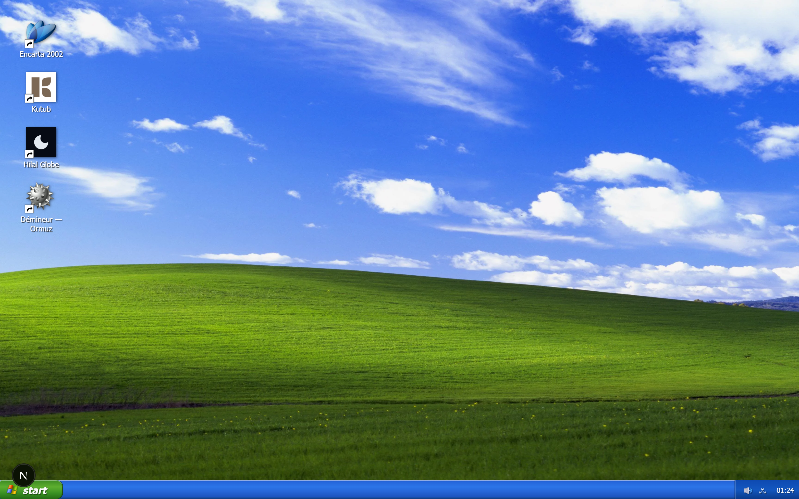
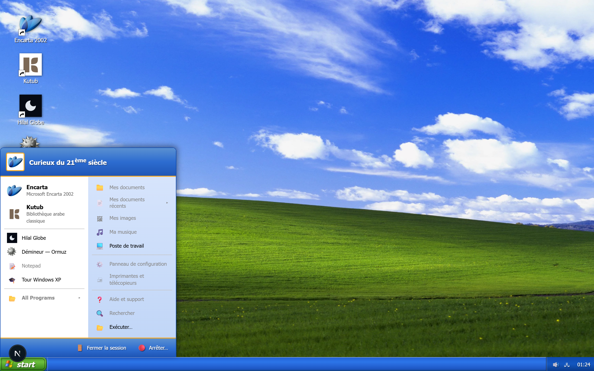
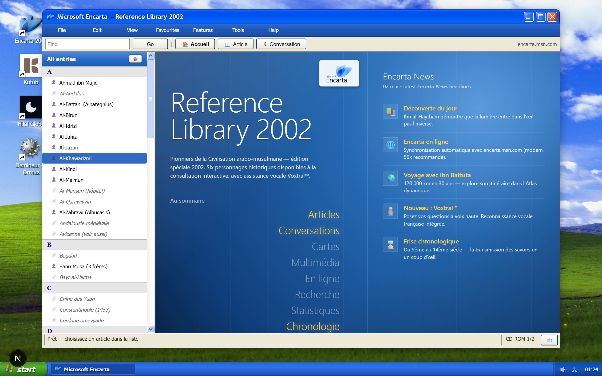
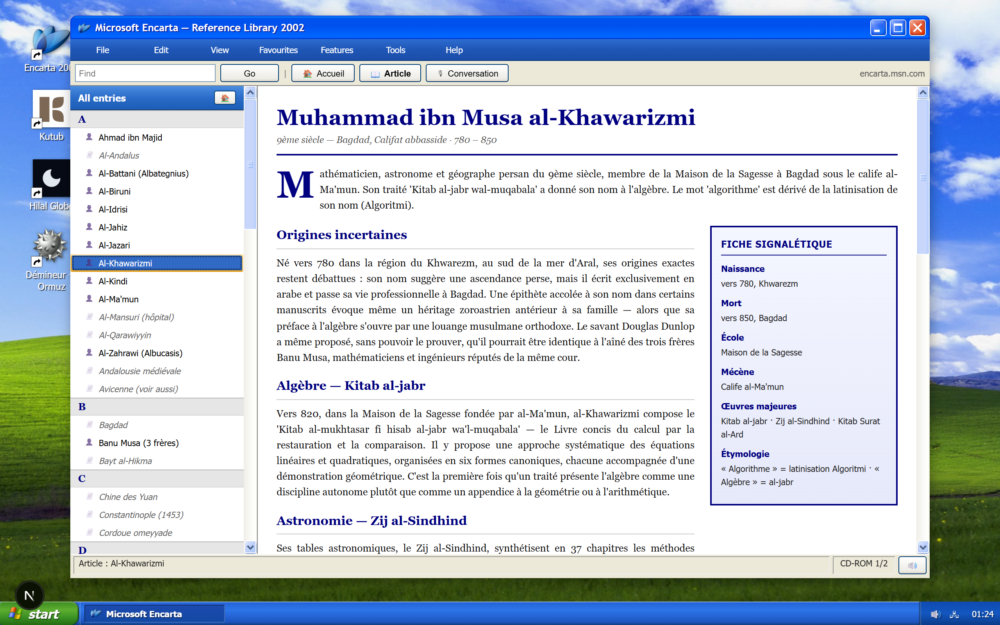
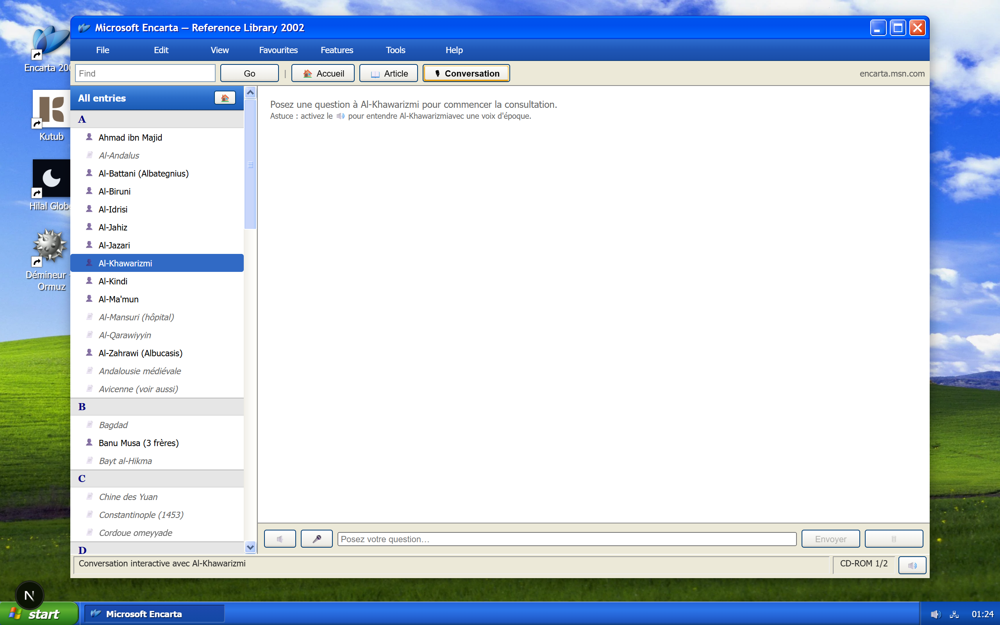
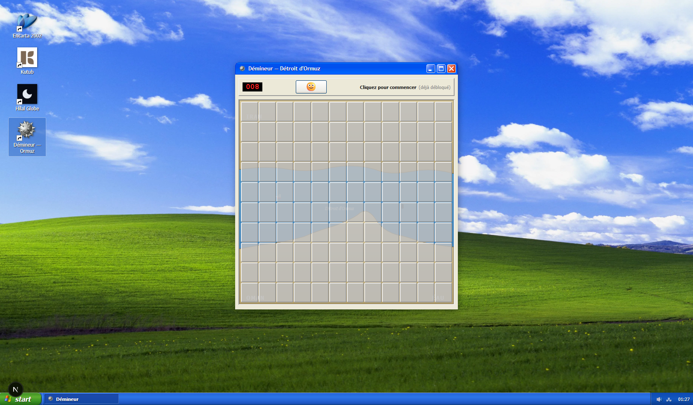
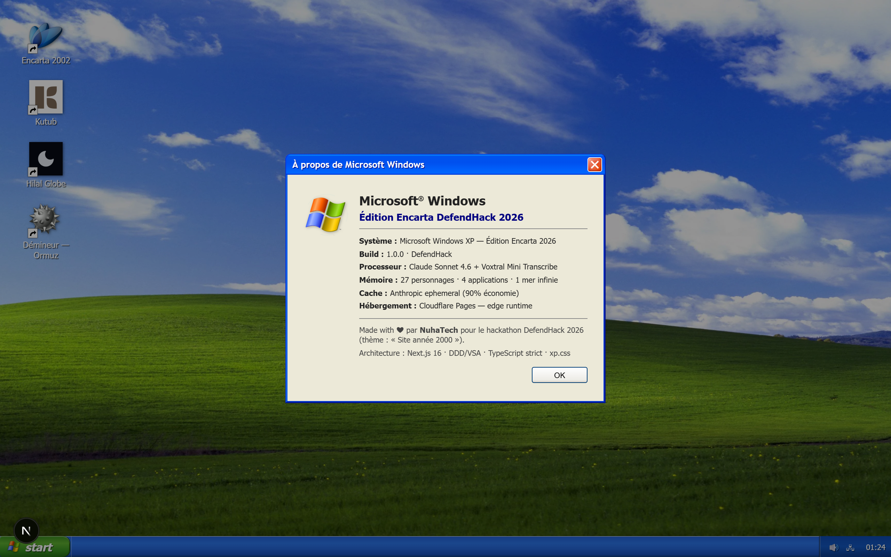

<div align="center">

# Al-Encarta

**Encyclopédie multimédia arabo-musulmane, ressuscitée en 2026 sur un faux Windows XP — chaque pionnier répond en streaming via Claude.**

Édition spéciale **DefendHack 2026** (thème : *Site année 2000*).



</div>

---

## Pitch

Un Encarta 2002 fidèle reconstitué dans le navigateur : boot BIOS → installer kitsch → bureau Windows XP → fenêtre Encarta avec **27 figures arabo-musulmanes** (Al-Khawarizmi, Ibn al-Haytham, Ibn Battuta, Ibn Khaldoun, Fatima al-Fihri…). Chaque article s'accompagne d'une **conversation interactive** où Claude Sonnet 4.6 incarne le personnage, avec voix robotique Y2K générée par le navigateur et reconnaissance vocale française via Voxtral.

L'objet est aussi une démo technique : prompt caching Anthropic byte-stable, vertical slice architecture, Cloudflare edge deploy, zéro framework UI à l'exception de [xp.css](https://botoxparty.github.io/XP.css/).

## Aperçu

<table>
  <tr>
    <td><b>Start menu XP authentique</b><br/></td>
    <td><b>Encarta — Reference Library 2002</b><br/></td>
  </tr>
  <tr>
    <td><b>Article : Al-Khawarizmi</b><br/></td>
    <td><b>Conversation streamée</b><br/></td>
  </tr>
  <tr>
    <td><b>Démineur — Ormuz</b><br/></td>
    <td><b>À propos · Tour Windows XP</b><br/></td>
  </tr>
</table>

## Stack

| | |
|---|---|
| **Front** | Next.js 16 (App Router) · React 19 · TypeScript strict · [xp.css](https://botoxparty.github.io/XP.css/) |
| **LLM** | Claude Sonnet 4.6 / Haiku 4.5 (préféré, prompt caching `ephemeral`) — fallback OpenAI `gpt-4.1-mini` |
| **STT** | Voxtral Mini Transcribe (Mistral La Plateforme) |
| **TTS** | Web Speech API navigateur — voix sélectionnée pour le kitsch |
| **Persistance** | `localStorage` côté client (pas de DB serveur) |
| **Deploy** | Cloudflare Workers via [`@opennextjs/cloudflare`](https://opennext.js.org/cloudflare) |
| **Tests** | Vitest |

## Quick start

```bash
pnpm install
cp .env.example .env.local      # éditer avec vos clés
pnpm dev                         # http://localhost:3000
```

Variables d'environnement (`.env.local`) — au moins une clé LLM :

```
ANTHROPIC_API_KEY=sk-ant-...    # préféré (prompt caching ephemeral)
OPENAI_API_KEY=sk-...           # fallback (gpt-5-mini, caching auto)
MISTRAL_API_KEY=...             # STT Voxtral (optionnel)
```

L'app détecte automatiquement le provider LLM disponible : Anthropic > OpenAI > FakeLlmGateway (réponses canned déterministes pour les 6 figures tier 1).

Raccourcis dev pour zapper le boot/installer :

| URL | Effet |
|---|---|
| `/?skip=desktop` | direct au bureau |
| `/?skip=encarta` | bureau + Encarta ouvert |

## Architecture

Bounded contexts DDD tactiques + Vertical Slice Architecture.

```
src/modules/
├── catalog/        # Encyclopédie : Personality (aggregate), VoiceComposer (byte-stable)
├── conversation/   # Chat IA : send-message slice, ports/gateways, transcript
└── shell/          # UI Windows XP : boot, installer, desktop, window manager
```

**Pourquoi DDD ici ?** Le levier dur du projet est le **prompt caching** (90 % de réduction sur les system prompts répétés). Pour qu'un cache hit soit déterministe, `VoiceComposer.compose()` doit retourner deux blocs `system` byte-identiques entre requêtes — d'où un domaine pur, testable, découplé du SDK.

Le découplage Port/Adapter paie : le swap **Anthropic → OpenAI** s'est fait en 1 nouveau fichier (`OpenAiLlmGateway`, ~80 lignes) + 1 ligne sur le port (élargir `model: string`) + 5 lignes dans la composition root. Zéro changement dans `catalog/` ou dans le handler.

```ts
// catalog/application/services/voice-composer.ts
[
  { type: 'text', text: GLOBAL_PREAMBLE,        cache_control: { type: 'ephemeral' } },
  { type: 'text', text: personalityVoicePrompt, cache_control: { type: 'ephemeral' } },
]
```

Test critique : `expect(compose(p)).toBe(compose(p))` byte-pour-byte (cf. `tests/unit/voice-composer.test.ts`).

### Vertical slice exemplaire — `send-message`

```
conversation/application/commands/send-message/
├── command.ts      # contrat : SendMessageCommand
├── validator.ts    # refus à la frontière
├── handler.ts      # logique pure, dépend de ports (LlmGateway, PersonalityRepo)
└── index.ts        # barrel
```

Le handler ignore Anthropic, Next, et le navigateur. La route handler `app/api/chat/route.ts` est une **composition root** edge-runtime qui injecte les adapters concrets et expose le SSE.

## Pipeline voix

**TTS** — `useSpeechSynthesis` choisit la voix navigateur la moins naturelle (heuristique kitsch Y2K), buffer phrase-par-phrase pendant que Claude génère, queue dans `speechSynthesis`. Pitch et rate par personnage : Khaldoun très grave (0.40), Battuta clair (0.62), Fatima al-Fihri féminine (1.15).

**STT** — bouton micro Y2K, 3 états (idle / recording / transcribing). `MediaRecorder` → blob → `POST /api/transcribe` → texte injecté dans le composer, l'utilisateur peut éditer avant d'envoyer.

## Personnages

**Tier 1** (6 figures principales, prompts rédigés à la main, voix tunées une à une)

> Al-Khawarizmi · Ibn al-Haytham · Ibn al-Nafis · Ibn Battuta · Ibn Khaldoun · Fatima al-Fihri

**Tier 2** (22 figures et lieux générés)

> Al-Battani · Al-Biruni · Al-Idrisi · Al-Jahiz · Al-Jazari · Al-Kindi · Al-Ma'mun · Al-Mansuri · Al-Zahrawi · Ahmad ibn Majid · Banu Musa · Ibn al-Banna · Ibn al-Razzaz · Ibn al-Shatir · Al-Andalus · Al-Qarawiyyin · Bagdad · Bayt al-Hikma · Chine des Yuan · Constantinople (1453) · Cordoue omeyyade · Andalousie médiévale

**+ 1 figure secrète**, débloquée par une victoire au Démineur — Ormuz (le secret se révèle dans la sidebar Encarta au prochain `Open`).

## Easter eggs

- **Triple-clic sur le wallpaper** → BSOD `WIN32K_DEFEND_HACK_FAILURE`
- **Clic-droit bureau → Propriétés** → dialog *À propos de Microsoft Windows*
- **Démineur — Ormuz** (12×10, 8 mines) → cliquer une mine révèle un manuscrit historique sur le détroit
- **Konami code** ↑↑↓↓←→←→BA → astrolabe interactif (chiffres en abjad arabe ١–١٢)
- **Win+R / Ctrl+R** → boîte *Exécuter*. Commandes :

  | commande | effet |
  |---|---|
  | `defendhack` | infos hackathon |
  | `1258` | siège de Bagdad |
  | `1453` | chute de Constantinople |
  | `bayt` | Bayt al-Hikma |
  | `hormuz` | détroit d'Ormuz |
  | `nuhatech` | NuhaTech |
  | `konami` | indice |
  | `bismillah` | — |
  | `help` | toutes les commandes |

- **Find dans Encarta** — 5 mots-clés débloquent des fiches culturelles cachées.

## Scripts

```bash
pnpm dev                       # dev server
pnpm build                     # next build
pnpm test                      # vitest run
pnpm test:watch                # vitest watch mode
pnpm typecheck                 # tsc --noEmit
pnpm lint                      # eslint
pnpm capture:screenshots       # régénère public/screenshots/ (requiert dev server up)
pnpm cf:build                  # build edge bundle
pnpm cf:preview                # worker preview local
pnpm cf:deploy                 # deploy Cloudflare Workers
```

`pnpm capture:screenshots` utilise Chrome système (`C:/Program Files/Google/Chrome/Application/chrome.exe`). Override avec `CHROME_PATH=...`.

## Déploiement Cloudflare

```bash
wrangler secret put ANTHROPIC_API_KEY
wrangler secret put MISTRAL_API_KEY
pnpm cf:deploy
```

Le worker est nommé `al-encarta` ([wrangler.jsonc](wrangler.jsonc)).

## Crédits

Made with ❤ by **[NuhaTech](https://github.com/NuhaTech)** pour le hackathon **DefendHack 2026** (thème : *Site année 2000*).

Produits sœurs : [kutub.io](https://kutub.io) · [muqabia.com](https://muqabia.com)
